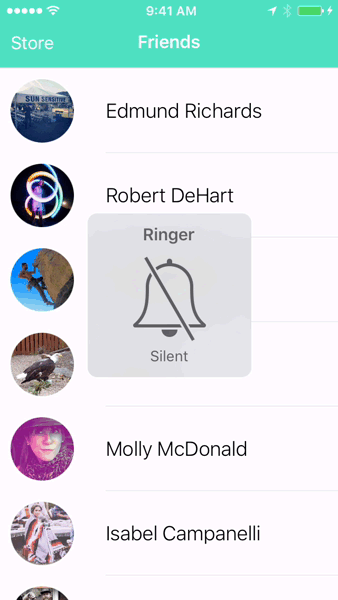

# React Native Statusbar Alert

A status bar alert (e.g. in-call, recording, navigating) for React Native

## Demos

### Basic

```js
<StatusBarAlert
  visible={true}
  message="Silent Switch ON"
  backgroundColor="#3CC29E"
  highlightColor="#50E4C2"
  color="white"
/>
```



### Pulse

```js
<StatusBarAlert
  visible={true}
  message="Silent Switch ON"
  backgroundColor="#3CC29E"
  highlightColor="#50E4C2"
  color="white"
  pulse="background"
/>
```


### Press

```js
<StatusBarAlert
  visible={true}
  message="Silent Switch ON"
  backgroundColor="#3CC29E"
  highlightColor="#50E4C2"
  color="white"
  onPress={() => this.navigator.push({id: 'SilentAlert'})}
/>
```


## Install

* Install: `npm install react-native-statusbar-alert --save`

## Usage

```js
<StatusBarAlert
  visible={true}
  message="Silent Switch ON"
  onPress={() => this.navigator.push({id: 'SilentAlert'})}
  pulse="text"
  backgroundColor="#3CC29E"
  highlightColor="#50E4C2"
  color="white"
/>
```

## Props

| Name            | description                     | Required    | Type                      |
| :-------------  | :------------------------------ | :---------- | :------------------------ |
| visible         | `true` to show, `false` to hide | true        | bool                      |
| message         | message to display in alert     | true        | string
| onPress         | callback on press event         | false        | func                    |
| pulse           | animate the text or background  | false       | enum('text','background') |
| backgroundColor | background color                | false       | [color](https://facebook.github.io/react-native/docs/colors.html) |
| highlightColor  | color on press and pulse        | false       | [color](https://facebook.github.io/react-native/docs/colors.html) |
| color           | text color                      | false       | [color](https://facebook.github.io/react-native/docs/colors.html) |
| statusbarHeight | custom status bar height<sup>1</sup>        | false       | int                   |

* <sup>1</sup> Use with [react-native-status-bar-size](https://github.com/brentvatne/react-native-status-bar-size) to get the actual status bar height

## Usage with Navigator on iOS

Navigator automatically offsets its navigation bar's top position by the height of the status bar ([source](https://github.com/facebook/react-native/blob/ca2fb70fa9affc6ad9acae6bf116c084cdaa0da3/Libraries/CustomComponents/Navigator/NavigatorNavigationBarStylesIOS.js#L42)). StatusBarAlert is positioned adjacent to the Navigator component and offsets the entire Navigator component by the height of the status bar. To correct the navigation bar's top position, simply add `top: -20` to the navigation bar's style.

```js
<Navigator
  initialRoute={initialRoute}
  renderScene={this.renderScene}
  navigationBar={
    <Navigator.NavigationBar
      routeMapper={routeMapper}
      style={{top: -20}}
    />
  }
/>
```

## Alert stack example

Much like a route stack, you can keep a alert stack as an array of alert objects in your component's state. The StatusBarAlert will render the first alert in the stack, so that as new alerts are pushed into the stack, it will render the most recent alert. If an alert is popped from the stack, StatusBarAlert will render any remaining alerts and when the stack is empty, StatusBarAlert will hide itself.

```js
render() {
  return (
    <View style={styles.container}>
      <StatusBarAlert
        backgroundColor="#3CC29E"
        highlightColor="#50E4C2"
        color="white"
        visible={this.state.alerts.length > 0}
        {...this.state.alerts[0]}
      />
      <Navigator
        initialRoute={initialRoute}
        renderScene={this.renderScene}
        navigationBar={
          <Navigator.NavigationBar
            routeMapper={routeMapper}
            style={{top: -20}}
          />
        }
      />
    </View>
  )
}
showSilentAlert() {
  this.setState({
    alerts: [{
      message: 'Silent Switch ON',
      onPress: () => this.navigator.push({id: 'SilentAlert'})
    }, ...this.state.alerts]
  })
}
hideSilentAlert() {
  this.setState({
    alerts: this.state.alerts.filter(alert => alert.message !== 'Silent Switch ON')
  })
}
```
